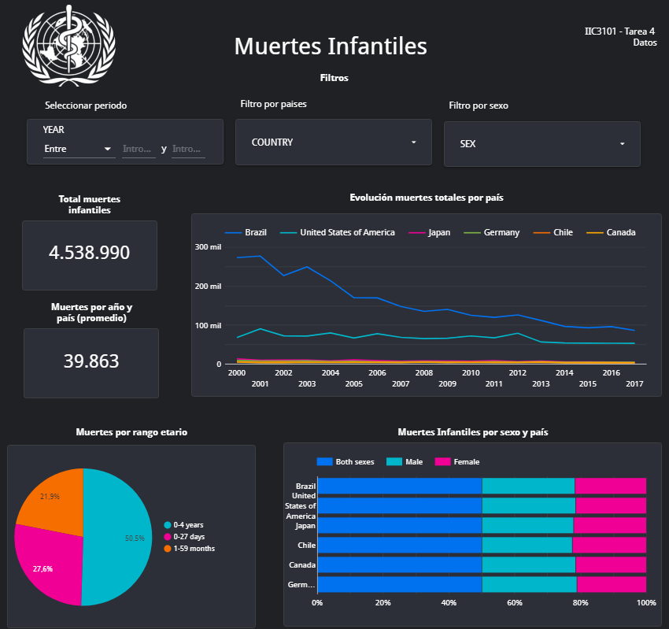

# Tarea 4 Taller

Para la extracción de los datos se utilizó el siguiente Google Colaboratory [link a colab](https://colab.research.google.com/drive/1edk25DZYw1w64hsy16XorPGSZZfEBb4r?usp=sharing). De igual forma están los archivos .ipynb y .py por si se quieren probar en local. Para que funcione el código se debe tener el archivo .json con las credenciales de Google en la misma carpeta que el script. 

Link al reporte en data estudio: https://datastudio.google.com/reporting/89503863-4254-4d61-8aec-5c1c09f0b407

Por temas de orden, el reporte se dividió en páginas según las secciones del enunciado. 

**Para tener acceso a los links se debe ingresar con una cuenta uc**

## Librerias utilizadas
- xmltodict
- gspread==3.6.0
- requests
- pandas

### Pantallazo dashboard

